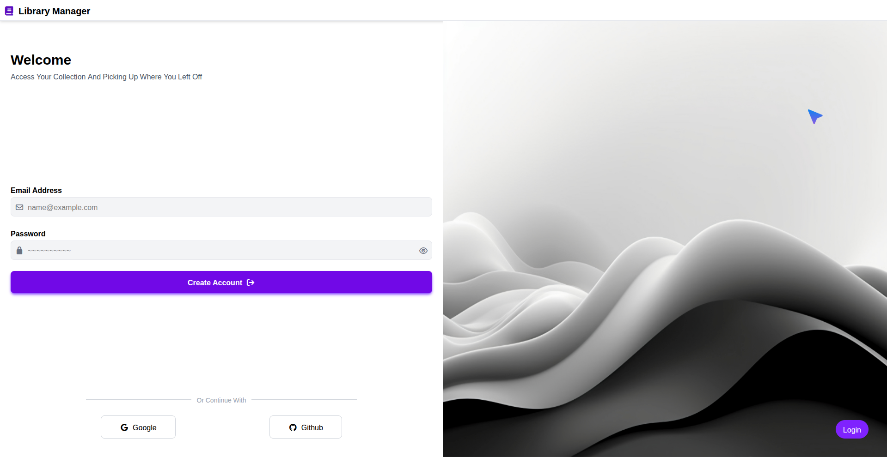

# To-do App

A simple browser-based log in page built with vanilla JavaScript




## About

* This was my mini project in my Javascript learning roadmap.
* The main goal was to understand how regex works in JavaScript with a soft UI animations

It is a very small project and has a lot of bugs but i love this project unless all my projects because it's the first project I started learning some basics in figma and learned how to plan for the project before coding even it's very small and doesn't has any complicated functions
also this project helped me to know the basics about authrisication and github and google connected account ( even i didn't put this in my project but i understand it for future )


---

## Features

* Aregex for the email validation
* Aregex for the password validation
* Responsive design

---

## Built With

* **HTML5** — page structure
* **CSS3** — styling
* **TailwindCSS** — UI design
* **JavaScript** — type safety and application logic

---

## Getting Started

Just open the live version:

[Launch App →](https://logwithjo.github.io/LoginPage)

---

## Project Structure

```text
To-do/
├── .gitignore
├── README.md
├── index.html
├── package.json
├── package-lock.json
├── server.js
├── tasks.json
├── tsconfig.json
├── preview.png
├── css/
│   ├── all.min.css
│   ├── style.css
│   ├── task-completed.png
│   └── john-towner-JgOeRuGD_Y4-unsplash.jpg
│
├── webfonts/
│   ├── fa-brands-400.woff2
│   ├── fa-regular-400.woff2
│   ├── fa-solid-900.woff2
│   └── fa-v4compatibility.woff2
│
└── src/
    ├── api.ts
    ├── data.ts
    ├── deletedPageData.ts
    ├── deletedPageDom.ts
    ├── deletedPageUi.ts
    ├── dom.ts
    ├── main.ts
    ├── types.ts
    └── ui.ts
```

---

## What I Learned

* Understanding how Regex works
* Patience during development

> Tomorrow will be better.
